<div align="center">

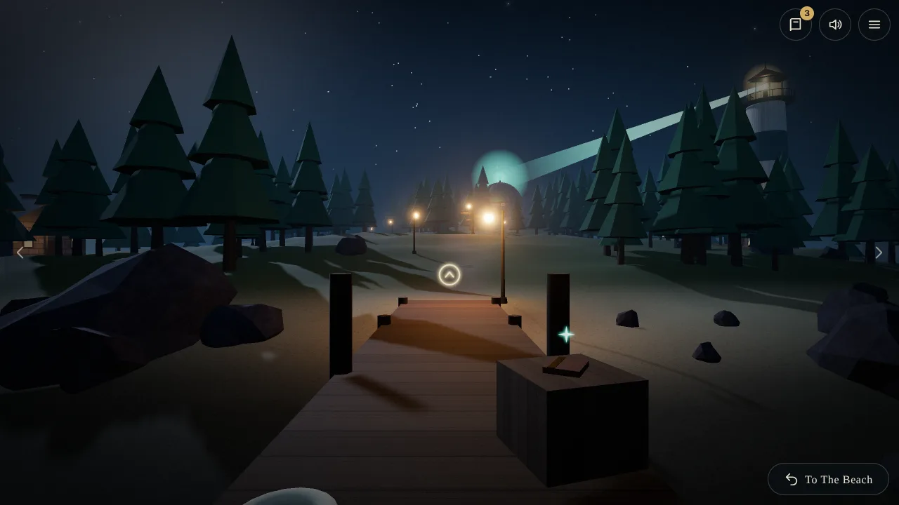

# Hollowtide

### a first-person puzzle island in three.js, typescript and webaudio

</div>

<br />

## 🌫️ The Pitch

The fog drops you on the dock of a silent island. Your boat is wrecked. The ferry only comes when it is called, and nothing on Hollowtide calls without power.

Walk between still, painted-looking scenes. Read the keeper's journals. Wake the tide engine, find the lost lamp lens, turn the star engine and open the vault. Then decide whether to ring for the ferry, or follow the keeper to the thing that really moves the tide.

Everything you see and hear is generated in code. No image, model or audio files ship with the game.

<br />

## 🚀 Quick Start

```bash
bun install
bun run dev
```

Open http://127.0.0.1:5227/ and press **Begin**.

```bash
bun run build     # static site in dist/
bun run preview   # serve dist/ locally
bun run test      # game logic tests
```

npm works too: `npm install`, `npm run dev`.

<br />

## 🎮 Controls

| Action | Mouse | Touch | Keys |
|---|---|---|---|
| Look around | Drag | Drag | Left / Right, A / D |
| Walk | Click a glowing ring | Tap a ring | Up or W walks toward the ring you face |
| Turn back | Step Back button | Step Back button | Down, S, Backspace |
| Use something | Click a lever, dial, book or glint | Tap it | Enter or Space uses what is in the center |
| Journal | Book button | Book button | J |
| Sound | Speaker button | Speaker button | M |
| Menu / close | Menu button | Menu button | Esc |

Progress saves in the browser after every action. **Continue** picks up where you left off.

<br />

## 🧩 What's Inside

### 🗺️ **The Island**

- **21 linked views**: dock, beach, crossroads, engine house, lighthouse, garden, sea stack, hill, cove, vault, grotto
- **Six rooms**: engine room, tower hall, lamp room, star dome, vault, grotto
- **A living world**: the tide really drops, the lamp beam really swings, the dome really lights

### ⚙️ **Six Interlocking Puzzles**

- **The tide engine**: six gates, one rating, one breaker
- **The chimes**: a tune kept in a music box
- **The lamp**: a lens to seat and a compass wheel to turn
- **The star dial**: three rings, three house marks
- **The vault door**: four signs that only show in the right light
- **The stack**: something that wakes only when the lamp, lens and tide agree

### 📖 **Five Journals, Two Endings**

- **Journals** hold every clue a careful reader needs
- **The ferry ending** is the way home
- **The hidden ending** is for players who read closely

### 🔊 **Generated Sound**

- **Wind, sea and drones** made from filtered noise and oscillators
- **Chimes and bells** built from inharmonic partials
- **Rooms** muffle and color the ambience as you enter them

<br />

## 📸 Screenshots

<p align="center">
  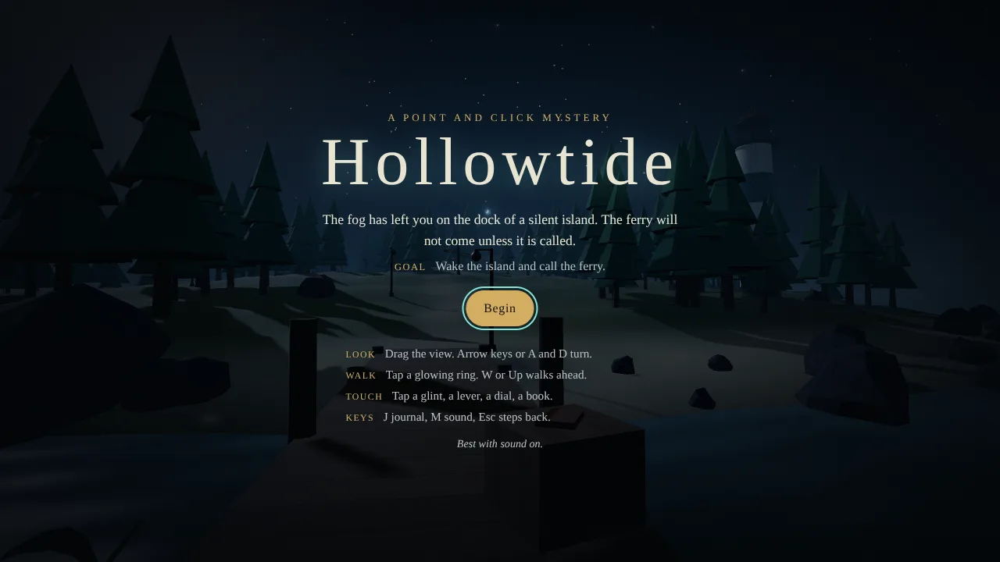
  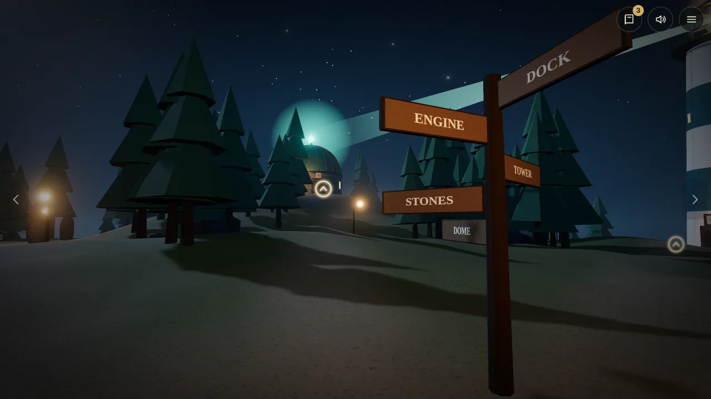
  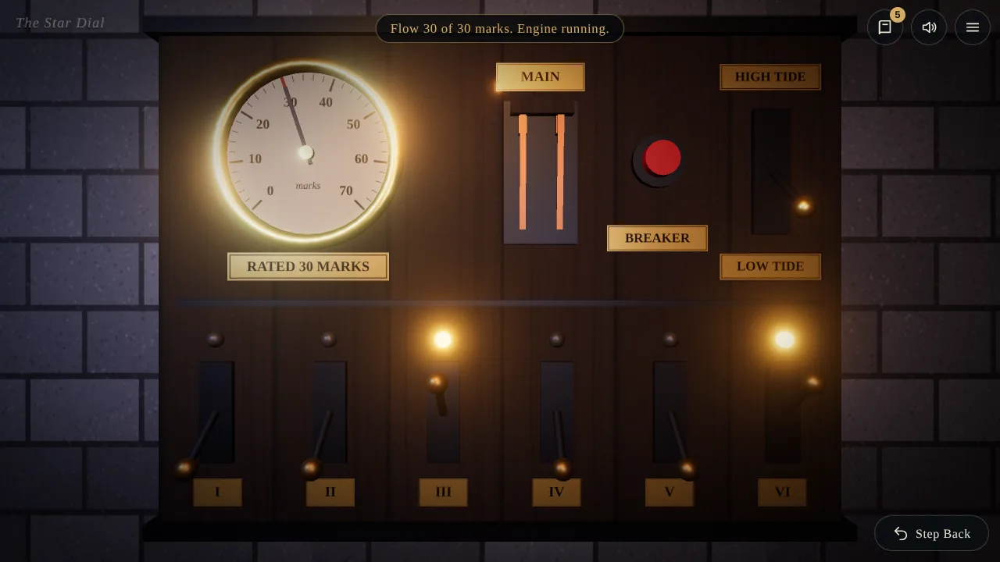
  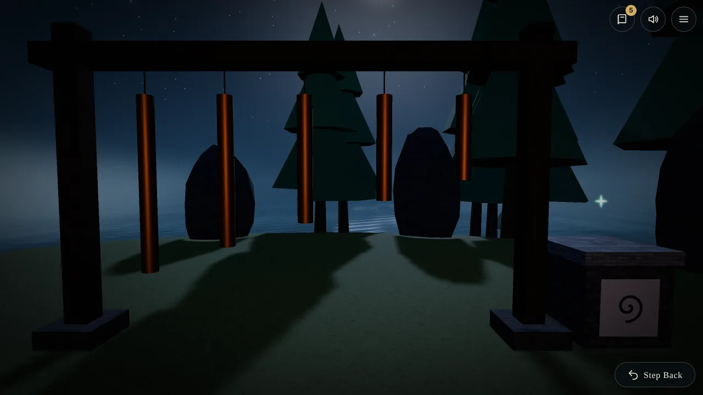
  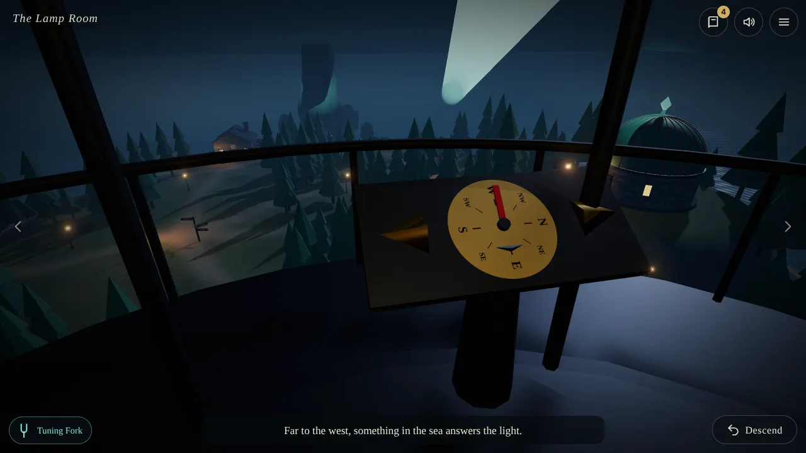
  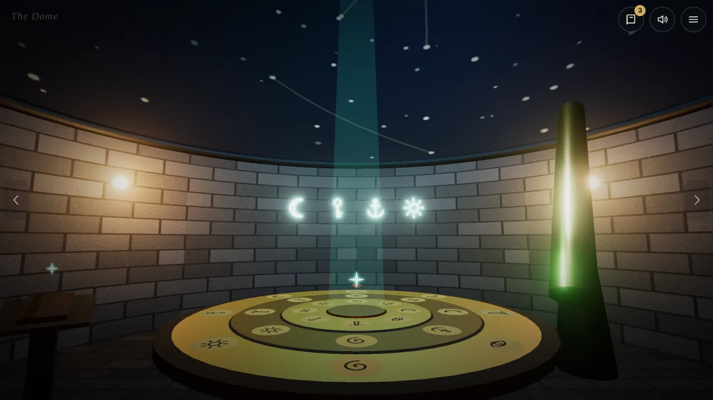
  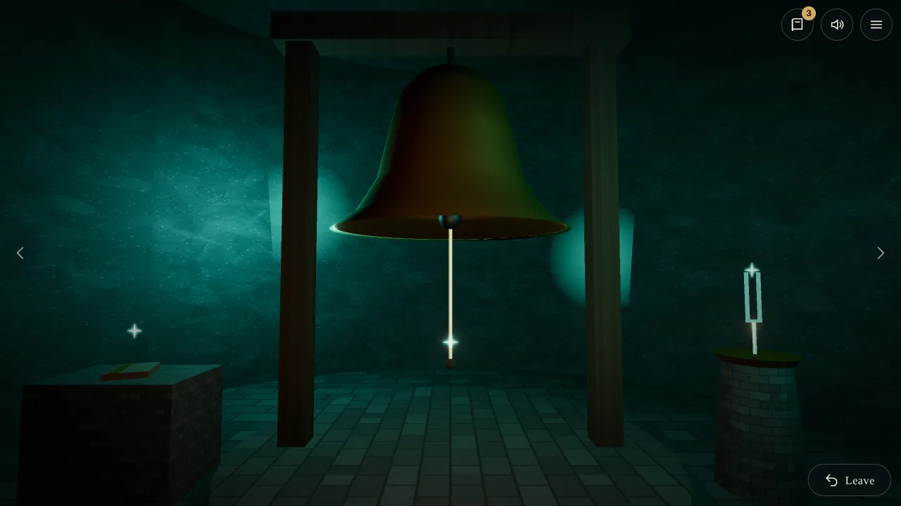
  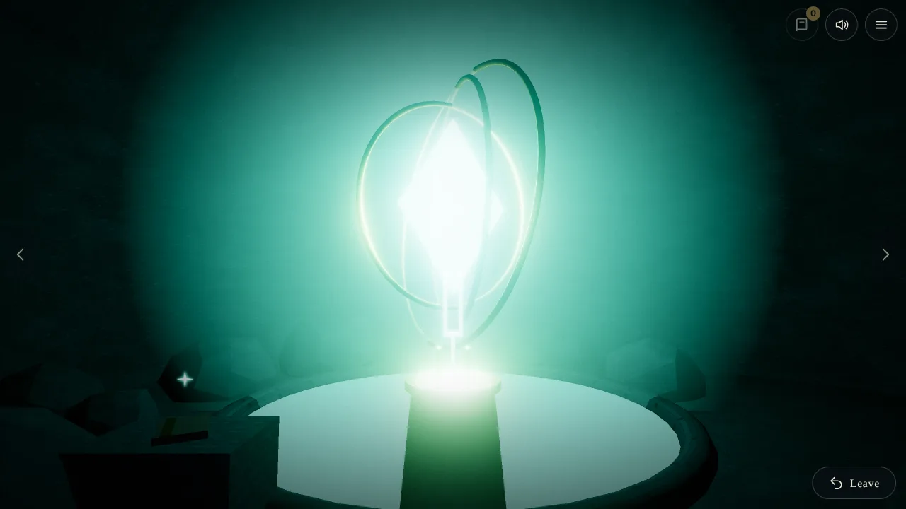
</p>

<p align="center">
  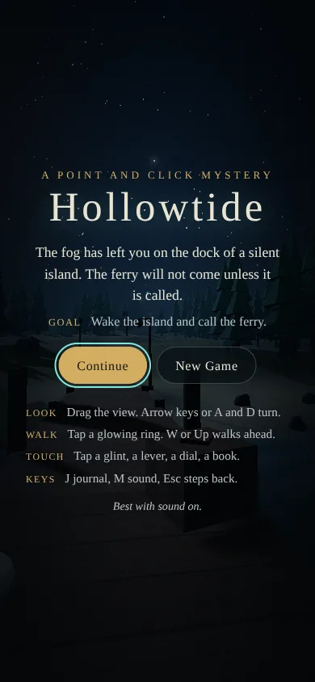
  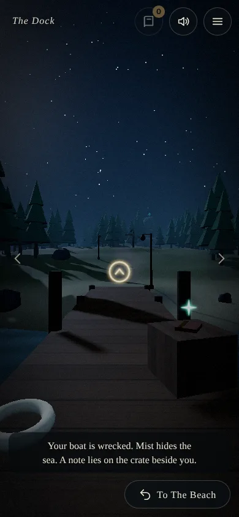
  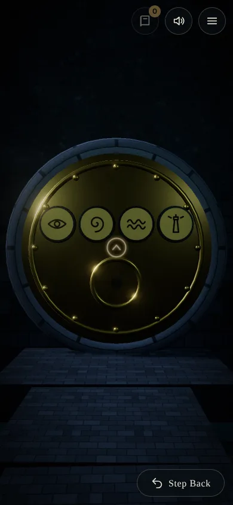
</p>

<br />

## 🛠️ Tech Stack

| Technology | Version | Purpose |
|---|---|---|
| **Three.js** | 0.186 | Scenes, lighting, post effects |
| **TypeScript** | 7.0 | Everything |
| **Vite** | 8.3 | Dev server and static build |
| **Vitest** | 5.0 | Game logic tests |
| **WebAudio** | Browser | All sound |

One runtime dependency: `three`.

<br />

## 🏗️ Architecture

The game is a pure reducer. `dispatch(state, action)` in `src/game/actions.ts` returns the next state plus a list of events (messages, sounds, moves, endings). It never touches the DOM or Three.js, so every puzzle and both endings are covered by plain unit tests, including a full scripted walkthrough.

`src/world/` builds the island and rooms from code: terrain from noise, textures on canvas, glyphs from SVG paths. Each landmark is a small `Site` with views, hotspots and a `sync(state)` that moves its parts to match the game. `src/app.ts` glues the reducer, the world, the sound and the DOM overlay together.

```ts
const result = dispatch(state, { type: 'toggleGate', index: 2 });
result.events; // [{ type: 'sfx', name: 'lever' }]
```

<br />

## 🤝 Contributing

```bash
git clone https://github.com/stevederico/hollowtide.git
cd hollowtide
bun install
bun run test
bun run dev
```

Add `?debug` to the URL in a production build to expose `window.hollowtide` for poking at state.

<br />

## 📄 License

MIT License. See [LICENSE](LICENSE).

<br />

<div align="center">

Built with Three.js and a lot of fog.

</div>
